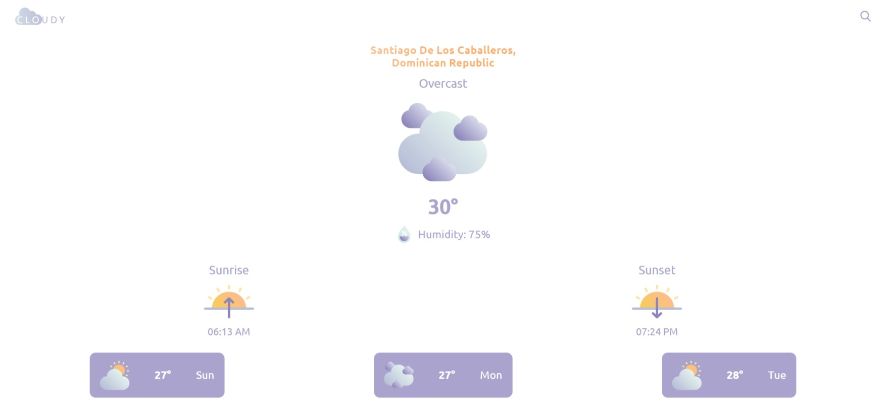

# Cloudy

| Landing Page                                        | Weather Page                                        |
| --------------------------------------------------- | --------------------------------------------------- |
|  |  |

Cloudy is a beautifully designed, yet simple weather app built using React, Styled Components, Context API and a third party API to fetch the weather. It displays the following weather information:

-   Landing page that explains what it does and how to use.
-   Weather
-   Location
-   Temperature
-   Sunrise & Sunset

# How to install

If you want to run this web app on your local machine, you need to register on [WeatherAPI](https://www.weatherapi.com/) to get a free key for their weather API. Then you can follow these steps:

-   Locate where you want the project to be located.
-   Open a terminal in that location and write `git clone https://github.com/Jerez09/cloudy.git`
-   Open the project on the editor of your choice.
-   Copy, paste and rename the `.env.example` file and assign the api key provided by WeatherAPI to the variable `REACT_APP_WEATHER_API_SECRET`
-   Open a new terminal and write `npm install`
-   Now run the project `npm run start`
-   Click the link displayed on your terminal, it will open a new tab in your browser.
